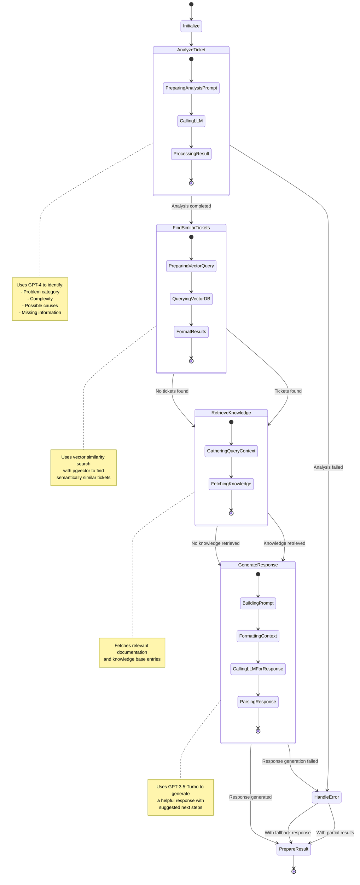

```mermaid
stateDiagram-v2
    [*] --> Initialize
    
    Initialize --> AnalyzeTicket
    
    state AnalyzeTicket {
        [*] --> PreparingAnalysisPrompt
        PreparingAnalysisPrompt --> CallingLLM
        CallingLLM --> ProcessingResult
        ProcessingResult --> [*]
    }
    
    AnalyzeTicket --> FindSimilarTickets: Analysis completed
    AnalyzeTicket --> HandleError: Analysis failed
    
    state FindSimilarTickets {
        [*] --> PreparingVectorQuery
        PreparingVectorQuery --> QueryingVectorDB
        QueryingVectorDB --> FormatResults
        FormatResults --> [*]
    }
    
    FindSimilarTickets --> RetrieveKnowledge: Tickets found
    FindSimilarTickets --> RetrieveKnowledge: No tickets found
    
    state RetrieveKnowledge {
        [*] --> GatheringQueryContext
        GatheringQueryContext --> FetchingKnowledge
        FetchingKnowledge --> [*]
    }
    
    RetrieveKnowledge --> GenerateResponse: Knowledge retrieved
    RetrieveKnowledge --> GenerateResponse: No knowledge retrieved
    
    state GenerateResponse {
        [*] --> BuildingPrompt
        BuildingPrompt --> FormattingContext
        FormattingContext --> CallingLLMForResponse
        CallingLLMForResponse --> ParsingResponse
        ParsingResponse --> [*]
    }
    
    GenerateResponse --> PrepareResult: Response generated
    GenerateResponse --> HandleError: Response generation failed
    
    HandleError --> PrepareResult: With partial results
    HandleError --> PrepareResult: With fallback response
    
    PrepareResult --> [*]
    
    note right of AnalyzeTicket
        Uses GPT-4 to identify:
        - Problem category
        - Complexity
        - Possible causes
        - Missing information
    end note
    
    note right of FindSimilarTickets
        Uses vector similarity search
        with pgvector to find
        semantically similar tickets
    end note
    
    note right of RetrieveKnowledge
        Fetches relevant documentation
        and knowledge base entries
    end note
    
    note right of GenerateResponse
        Uses GPT-3.5-Turbo to generate
        a helpful response with
        suggested next steps
    end note
``` 