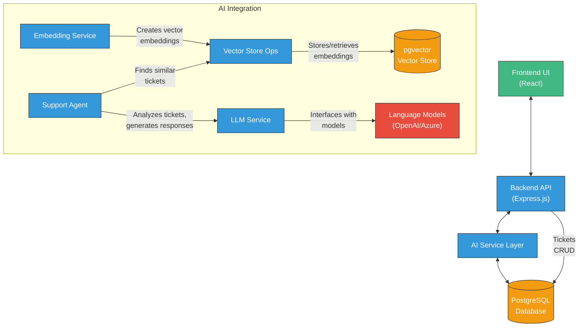

```mermaid
flowchart TB
    %% Main Components
    UI["Frontend UI\n(React)"]
    API["Backend API\n(Express.js)"]
    AI["AI Service Layer"]
    DB[(PostgreSQL\nDatabase)]
    VSTORE[(pgvector\nVector Store)]
    LLM["Language Models\n(OpenAI/Azure)"]
    
    %% AI Components
    EMBED["Embedding Service"]
    AGENT["Support Agent"]
    LLMSVC["LLM Service"]
    VECTOP["Vector Store Ops"]
    
    %% Relationships
    UI <--> API
    API <--> AI
    AI <--> DB
    
    %% AI Internal Structure
    subgraph "AI Integration"
        AGENT -- "Analyzes tickets,\ngenerates responses" --> LLMSVC
        EMBED -- "Creates vector\nembeddings" --> VECTOP
        VECTOP -- "Stores/retrieves\nembeddings" --> VSTORE
        LLMSVC -- "Interfaces with\nmodels" --> LLM
        AGENT -- "Finds similar\ntickets" --> VECTOP
    end
    
    %% Relationship with External Systems
    API -- "Tickets\nCRUD" --> DB
    
    %% Style Definitions
    classDef frontend fill:#42b883,color:white,stroke:#333,stroke-width:1px
    classDef backend fill:#3498db,color:white,stroke:#333,stroke-width:1px
    classDef database fill:#f39c12,color:white,stroke:#333,stroke-width:1px
    classDef ai fill:#9b59b6,color:white,stroke:#333,stroke-width:1px
    classDef external fill:#e74c3c,color:white,stroke:#333,stroke-width:1px
    
    %% Apply Styles
    class UI frontend
    class API,AGENT,EMBED,LLMSVC,VECTOP,AI backend
    class DB,VSTORE database
    class LLM external
``` 