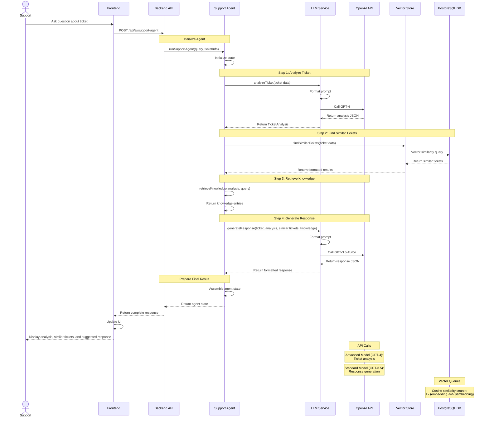

```mermaid
sequenceDiagram
    actor Support
    participant FE as Frontend
    participant API as Backend API
    participant SA as Support Agent
    participant LLM as LLM Service
    participant OAI as OpenAI API
    participant VS as Vector Store
    participant DB as PostgreSQL DB
    
    Support->>FE: Ask question about ticket
    
    FE->>API: POST /api/ai/support-agent
    
    Note over API,SA: Initialize Agent
    API->>SA: runSupportAgent(query, ticketInfo)
    SA->>SA: Initialize state
    
    Note over SA,OAI: Step 1: Analyze Ticket
    SA->>LLM: analyzeTicket(ticket data)
    LLM->>LLM: Format prompt
    LLM->>OAI: Call GPT-4
    OAI-->>LLM: Return analysis JSON
    LLM-->>SA: Return TicketAnalysis
    
    Note over SA,DB: Step 2: Find Similar Tickets
    SA->>VS: findSimilarTickets(ticket data)
    VS->>DB: Vector similarity query
    DB-->>VS: Return similar tickets
    VS-->>SA: Return formatted results
    
    Note over SA,OAI: Step 3: Retrieve Knowledge
    SA->>SA: retrieveKnowledge(analysis, query)
    SA-->>SA: Return knowledge entries
    
    Note over SA,OAI: Step 4: Generate Response
    SA->>LLM: generateResponse(ticket, analysis, similar tickets, knowledge)
    LLM->>LLM: Format prompt
    LLM->>OAI: Call GPT-3.5-Turbo
    OAI-->>LLM: Return response JSON
    LLM-->>SA: Return formatted response
    
    Note over SA,API: Prepare Final Result
    SA->>SA: Assemble agent state
    SA-->>API: Return agent state
    
    API-->>FE: Return complete response
    
    FE->>FE: Update UI
    FE-->>Support: Display analysis, similar tickets, and suggested response
    
    Note over OAI: API Calls
    Note over OAI: Advanced Model (GPT-4):<br>Ticket analysis
    
    Note over OAI: Standard Model (GPT-3.5):<br>Response generation
    
    Note over DB: Vector Queries
    Note over DB: Cosine similarity search:<br>1 - (embedding <=> $embedding)
``` 