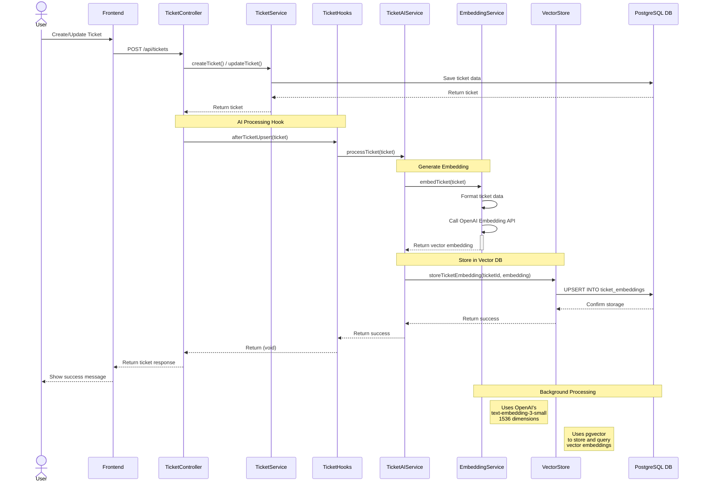

```mermaid
sequenceDiagram
    actor User
    participant FE as Frontend
    participant TC as TicketController
    participant TS as TicketService
    participant TH as TicketHooks
    participant AI as TicketAIService
    participant ES as EmbeddingService
    participant VS as VectorStore
    participant DB as PostgreSQL DB
    
    User->>FE: Create/Update Ticket
    FE->>TC: POST /api/tickets
    TC->>TS: createTicket() / updateTicket()
    TS->>DB: Save ticket data
    DB-->>TS: Return ticket
    TS-->>TC: Return ticket
    
    Note over TC,TH: AI Processing Hook
    TC->>TH: afterTicketUpsert(ticket)
    TH->>AI: processTicket(ticket)
    
    Note over AI,ES: Generate Embedding
    AI->>ES: embedTicket(ticket)
    ES->>ES: Format ticket data
    ES->>+ES: Call OpenAI Embedding API
    ES-->>-AI: Return vector embedding
    
    Note over AI,VS: Store in Vector DB
    AI->>VS: storeTicketEmbedding(ticketId, embedding)
    VS->>DB: UPSERT INTO ticket_embeddings
    DB-->>VS: Confirm storage
    VS-->>AI: Return success
    
    AI-->>TH: Return success
    TH-->>TC: Return (void)
    TC-->>FE: Return ticket response
    FE-->>User: Show success message
    
    Note over ES,DB: Background Processing
    
    Note right of ES: Uses OpenAI's<br>text-embedding-3-small<br>1536 dimensions
    
    Note right of VS: Uses pgvector<br>to store and query<br>vector embeddings
``` 