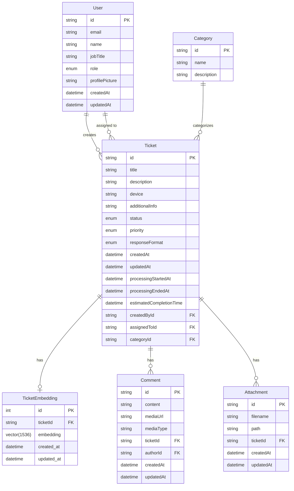

```mermaid
erDiagram
    Ticket ||--o| TicketEmbedding : "has"
    Ticket ||--o{ Comment : "has"
    Ticket ||--o{ Attachment : "has"
    User ||--o{ Ticket : "creates"
    User ||--o{ Ticket : "assigned to"
    Category ||--o{ Ticket : "categorizes"
    
    Ticket {
        string id PK
        string title
        string description
        string device
        string additionalInfo
        enum status
        enum priority
        enum responseFormat
        datetime createdAt
        datetime updatedAt
        datetime processingStartedAt
        datetime processingEndedAt
        datetime estimatedCompletionTime
        string createdById FK
        string assignedToId FK
        string categoryId FK
    }
    
    TicketEmbedding {
        int id PK
        string ticketId FK
        vector(1536) embedding
        datetime created_at
        datetime updated_at
    }
    
    Comment {
        string id PK
        string content
        string mediaUrl
        string mediaType
        string ticketId FK
        string authorId FK
        datetime createdAt
        datetime updatedAt
    }
    
    User {
        string id PK
        string email
        string name
        string jobTitle
        enum role
        string profilePicture
        datetime createdAt
        datetime updatedAt
    }
    
    Category {
        string id PK
        string name
        string description
    }
    
    Attachment {
        string id PK
        string filename
        string path
        string ticketId FK
        datetime createdAt
        datetime updatedAt
    }
    
    %% Notes about pgvector
    %% Vector specific operations
    %% 1 - (embedding <=> $embedding) AS similarity
``` 